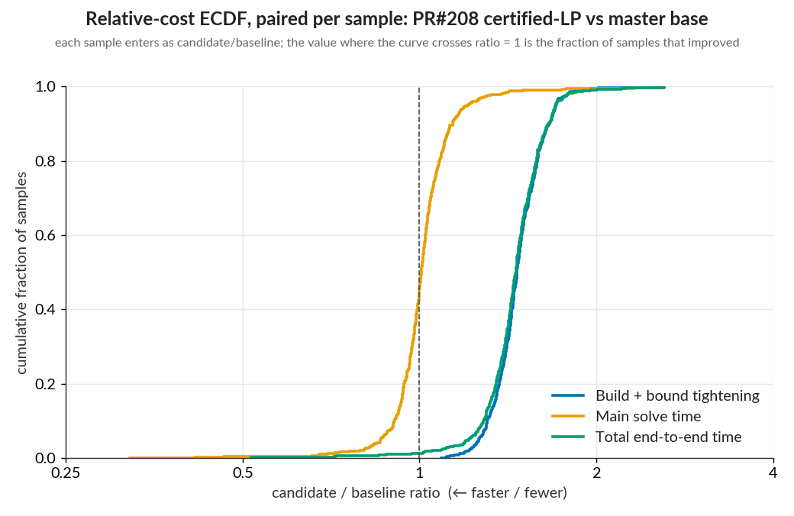
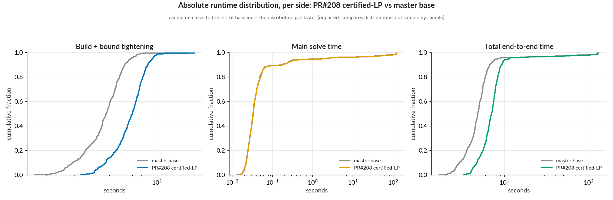
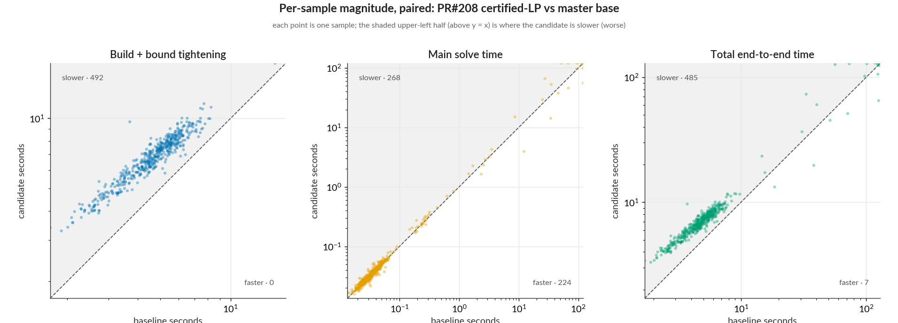

# PR #208 — certified LP tightening: WK17a LP paired benchmark

Paired before/after benchmark for [#208](https://github.com/vtjeng/MIPVerify.jl/pull/208)
(certify LP tightening bounds from row duals). Distribution analysis added **retroactively** —
the paired-analysis tooling post-dates the PR.

- **Baseline:** `master` `1bb2f9d82a762ac5f90beca10c7493d2e13d42ea`
- **Candidate:** `bugfix/certified-lp-bounds` `f8e02c2c6e947b1b720b89ea9d25a8ba46387380`
- **Settings (both):** `--samples 1:500 --tightening lp --main-time-limit 120 --norm-order Inf --log-level warn`
- **Environment:** Julia 1.12.6, single thread, sequential runs, identical dependency snapshot
  (`803cbbe702d8ffe785cf653abcba05add104cf30a4c4e79df2d187b1bcbbbed9`); solver HiGHS. Local WSL2
  workstation — not comparable to the CI-hosted `benchmark-results` series.

## Headline

Certifying LP bounds is a correctness fix that **costs performance**: +29.8% aggregate wall clock,
but the *typical* sample is worse than that (+45.8% median), because the aggregate is pulled down by
a few large samples. The cost is entirely in **build + bound tightening** (median +46.6%, every
sample slower); **main solve is unaffected** (median +0.7%, ~even split, and its small aggregate
change is 89% concentrated in 10 samples — noise, not a systematic effect). 1 of 500 verdicts changed,
in the candidate's favor.

## Per-sample ratio distribution

Ratio = candidate / baseline; < 1 is faster/fewer. Improved/regressed use a ±1% band.
Total end-to-end = Build + bound tightening + Main solve.

| series | n | min | p10 | p25 | median | p75 | p90 | max | improved | regressed |
|---|--:|--:|--:|--:|--:|--:|--:|--:|--:|--:|
| Build + bound tightening | 492 | 1.09 | 1.30 | 1.39 | 1.47 | 1.56 | 1.65 | 2.61 | 0% | 100% |
| Main solve time | 492 | 0.32 | 0.91 | 0.96 | 1.01 | 1.06 | 1.14 | 2.40 | 40% | 48% |
| Total end-to-end time | 492 | 0.52 | 1.28 | 1.37 | 1.46 | 1.56 | 1.66 | 2.60 | 1% | 99% |

## Aggregate saving and concentration

Net saved = baseline − candidate total (positive = candidate cheaper). Pooled = candidate ÷ baseline
total, the aggregate counterpart to the per-sample median. Concentration = share of the total
absolute per-sample change from the 10 biggest movers.

| series | baseline | candidate | net saved | pooled | top-10 concentration |
|---|--:|--:|--:|--:|--:|
| Build + bound tightening | 2334 s | 3383 s | −1049 s | 1.45 | 4% |
| Main solve time | 1438 s | 1513 s | −74 s | 1.05 | 89% |
| Total end-to-end time | 3772 s | 4895 s | −1123 s | 1.30 | 25% |

## Plots

Relative — paired ECDF of per-sample ratios:

Absolute — per-side runtime distributions:

Paired magnitude — candidate vs baseline per sample (below the diagonal = faster; shaded = slower):

## Reproduce

Raw per-sample data and dependency snapshots are in `baseline/` and `candidate/`. Regenerate the
plots and tables with the paired-analysis tool:

    analyze_pair --baseline baseline --candidate candidate --out .
