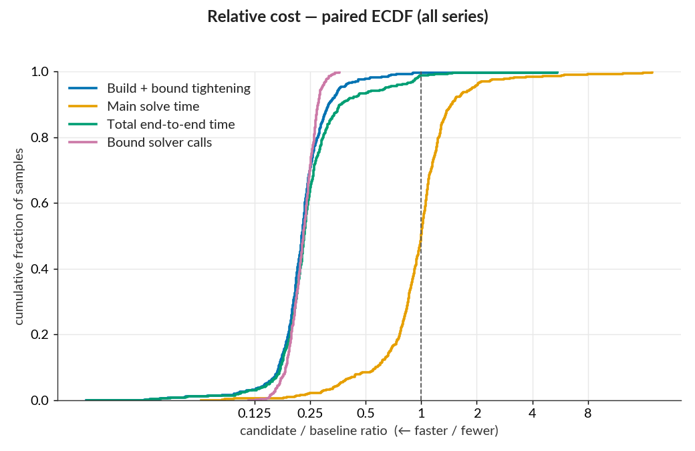
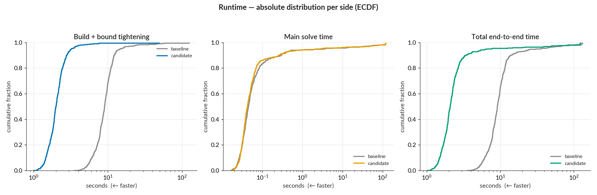
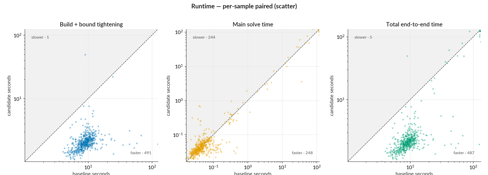
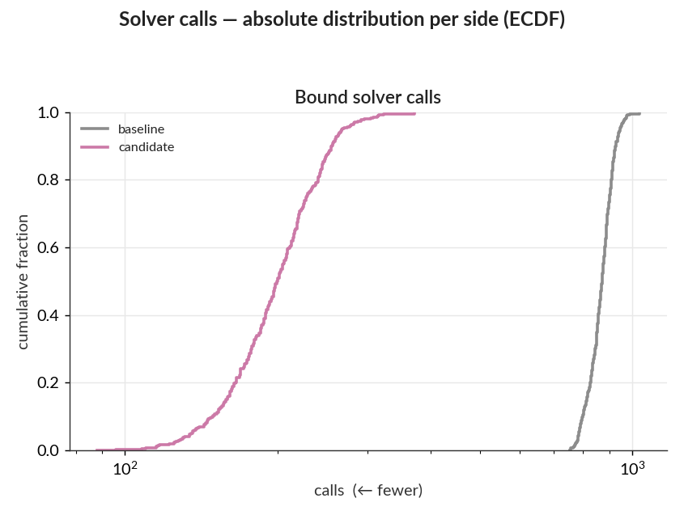
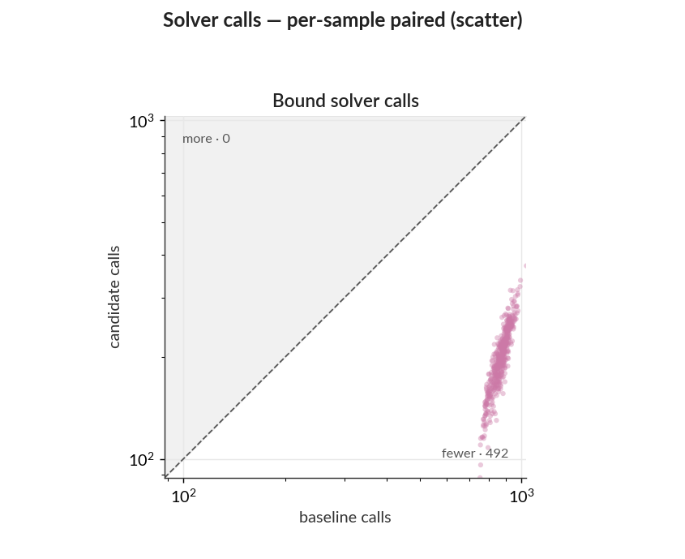

# PR #209 — progressive ReLU tightening: WK17a LP paired benchmark

PR #209 screens ReLU bounds progressively — interval arithmetic first, then LP, escalating only
when the cheaper bound cannot fix the unit's phase — instead of solving every bound with the full
tightening algorithm. Paired before/after benchmark. Raw per-sample data and dependency snapshots
are in `baseline/` and `candidate/`.

- **Baseline** master `ed9194c805bd0e96d06f34f0f7c51df059a2e772` (the #214 instrumentation merge,
  PR #209's base)
- **Candidate** optimization/progressive-relu-tightening `6bf062b3893827421a79df50d9399b8368998cf0`
  (pre-rebase tip; `src/` is byte-identical to the current PR head `6a58022`, which only rebased
  onto newer master)
- `--samples 1:500 --tightening lp --main-time-limit 120 --norm-order Inf --log-level warn`
- Julia 1.12.6, single thread, sequential runs, identical dependency snapshot
  (`252b56ff7f5ac035de4a16a8bec8b048cd422229c5c1fe52dc450dd2d644a791`); solver HiGHS. Local WSL2
  workstation with unrelated background jobs holding ~3 cores throughout both sides — not
  comparable to the CI-hosted `benchmark-results` series.

---

## Summary

- **−59% aggregate wall clock** (6,446 s → 2,634 s), and the typical sample improves even more: **median total ratio 0.23** (4.3× faster). The pooled ratio (0.41) sits above the median because the largest samples are main-solve-bound and gain the least.
- The win is all in **build + bound tightening**: median ratio 0.23, 491/492 samples improved. The one regression (sample 68, 9 s → 49 s) is a transient machine stall, not algorithmic — its solver calls fell 910 → 245 and solver wall time was flat (1.24 s → 1.37 s); the extra time is non-solver residual, and neighboring samples ran normally.
- **Bound solver calls drop 4.3×** (427,076 → 99,067) with a tight spread (per-sample ratios 0.12–0.36): every sample needs fewer LP solves, so the speedup is systematic rather than outlier-driven.
- **Main solve is unaffected** (median ratio 1.00, pooled 1.00). Its −7 s aggregate is 86% concentrated in the 10 biggest movers — noise around the 120 s limit, same reading as in the PR #208 report.
- **Verdicts:** 3 of 500 semantic outcomes changed, net in the candidate's favor (samples 212 and 446 now find adversarial examples within the limit; sample 321 regressed to unresolved). A disjoint set of 3 samples churned solve status near the 120 s limit. Objective values agree elsewhere (max abs diff 0.014 across 484 comparable samples).

## Detailed statistics

### Per-sample ratio distribution

| series | n | min | p10 | p25 | median | p75 | p90 | max | improved | regressed |
|---|--:|--:|--:|--:|--:|--:|--:|--:|--:|--:|
| Build + bound tightening | 492 | 0.02 | 0.17 | 0.20 | 0.23 | 0.26 | 0.31 | 5.44 | 100% | 0% |
| Main solve time | 492 | 0.06 | 0.57 | 0.81 | 1.00 | 1.19 | 1.45 | 17.83 | 48% | 47% |
| Total end-to-end time | 492 | 0.02 | 0.17 | 0.20 | 0.23 | 0.28 | 0.36 | 5.45 | 99% | 1% |
| Bound solver calls | 492 | 0.12 | 0.18 | 0.20 | 0.23 | 0.25 | 0.28 | 0.36 | 100% | 0% |

- `ratio` = candidate ÷ baseline; < 1 = candidate faster. `improved`/`regressed` use a ±1% band
  and round to whole percent — build+tightening's lone regression (sample 68, the `max` entry)
  rounds to 0%.
- `build` = constructing the MIP model; `tightening` = the LP bound-tightening pass; `main solve` = the final verification MIP.
- `total` = `build` + `tightening` + `main solve`.

### Aggregate saving and concentration

| series | baseline | candidate | net saved | pooled ratio | top-10 concentration |
|---|--:|--:|--:|--:|--:|
| Build + bound tightening | 4914 s | 1109 s | +3805 s | 0.23 | 13% |
| Main solve time | 1532 s | 1526 s | +7 s | 1.00 | 86% |
| Total end-to-end time | 6446 s | 2634 s | +3812 s | 0.41 | 14% |
| Bound solver calls | 427076 calls | 99067 calls | +328009 calls | 0.23 | 2% |

- `net saved` = baseline − candidate; positive = candidate cheaper.
- `pooled ratio` = candidate total ÷ baseline total (the aggregate counterpart to the per-sample `median`).
- `top-10 concentration` = the 10 samples with the largest absolute change account for this share of the total absolute per-sample change (0–100%; higher = a few samples dominate).

### Solve status and verdict flips

| status | master `ed9194c` | PR#209 `6bf062b` |
|---|--:|--:|
| INFEASIBLE | 476 | 476 |
| OPTIMAL | 10 | 9 |
| SKIPPED_PREDICTED_IN_TARGETED | 8 | 8 |
| TIME_LIMIT | 6 | 7 |

3 samples changed solve status and a disjoint set of 3 changed semantic outcome — a `TIME_LIMIT`
solve that carries an incumbent still counts as an adversarial example found, so the two tables
move independently.

Solve status:

| transition | n | samples |
|---|--:|---|
| `OPTIMAL` → `TIME_LIMIT` | 2 | 150, 449 |
| `TIME_LIMIT` → `OPTIMAL` | 1 | 242 |

Semantic outcome:

| transition | n | samples |
|---|--:|---|
| `time_limit_unresolved` → `adversarial_example_found_or_best_known` | 2 | 212, 446 |
| `adversarial_example_found_or_best_known` → `time_limit_unresolved` | 1 | 321 |

### Plots

The tightening and total curves sit almost entirely left of parity with a narrow spread — the
speedup is systematic, not outlier-driven; main solve straddles 1. The call-count curve is the
tightest of all: screening eliminates roughly three quarters of LP solves on every sample.

The entire tightening distribution shifts ~4× left while the main-solve curves overlap, so the
total's improvement is pure tightening.

Tightening and total points sit well below the diagonal across the full runtime range — large and
small samples alike. Sample 68 is the lone tightening point above it (the transient stall noted in
the summary).

Call counts drop by a near-constant factor across the whole distribution: the screening pass does
the work everywhere, not on a lucky subset.

## Reproduce

Regenerate the plots and tables from the raw per-sample CSVs (from a repo checkout):

    uv run --project benchmarks/analysis benchmarks/analysis/analyze_pair.py \
        --baseline baseline --candidate candidate --out . \
        --baseline-label "base ed9194c" --candidate-label "PR#209 6bf062b"
