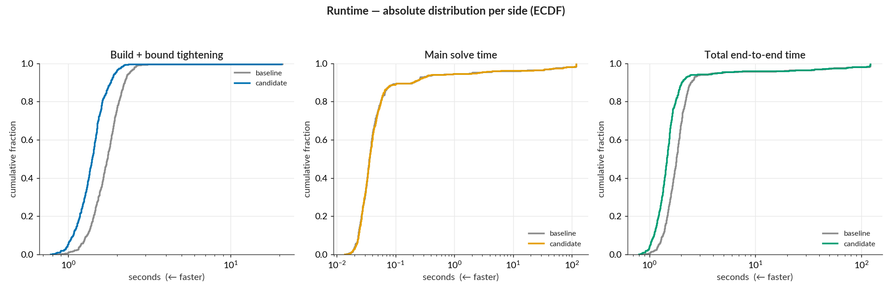
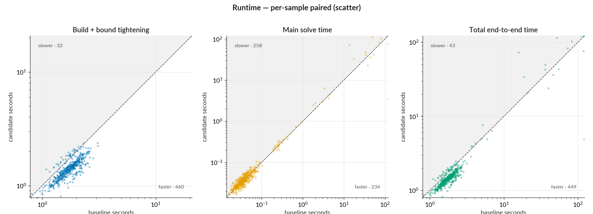
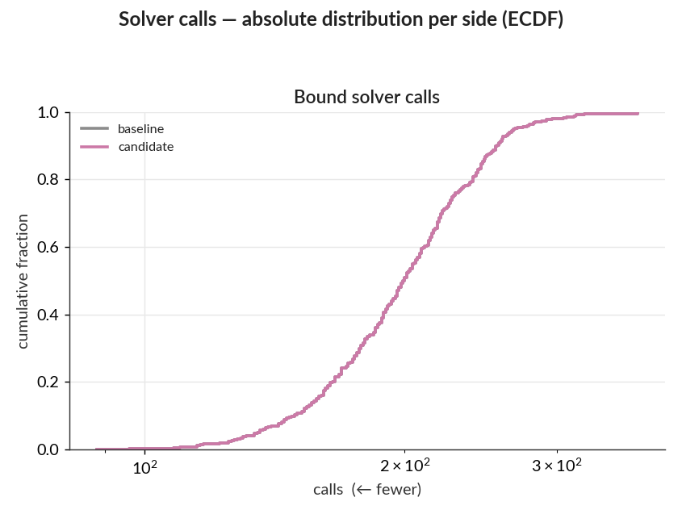

# Performance report: WK17a, LP tightening, 500 samples

PR #222 reads row duals once per affine constraint group when building an LP certificate.
The baseline reads each constraint through `JuMP.dual`. This report measures the change after PR
#209's progressive ReLU tightening, where the remaining certificate overhead matters most.

This benchmark measures the performance of the verification code. Samples 1–500 of the MNIST test
set are verified against the `MNIST.WK17a_linf0.1_authors` network on the master and feature
commits under identical settings. The ratio distributions, scatter plots, and outcome flips
below compare each sample's candidate run with its own baseline run; the absolute-runtime
distributions summarize each side separately.

- Baseline: post-#209 master `8a455e2756a0d45e224bb1da95f2de8dc2ba3df4`
- Candidate: PR #222 `5b407044078c1ea6108b893f8fd81d8d7f5538c3`
- Current PR head: `71e6405`; it differs from the measured candidate only by removing the completed
  benchmark TODO.
- Arguments: `--samples 1:500 --tightening lp --main-time-limit 120 --norm-order Inf`
- Julia 1.12.6, one thread, sequential runs on a local WSL2 workstation
- All solves (the bound-tightening LPs and the final verification MIP) use HiGHS, an
  open-source LP/MIP solver.
- Identical dependency snapshot:
  `1cfef4c977ff08219a888aa479cb94eea0b3dbc16f654d1fc0a09167c8f1c74a`

Raw per-sample data, tightening rows, ReLU rows, metrics, and dependency snapshots are in
`baseline/` and `candidate/`. The `control/` directory contains a same-commit repeat described
below.

## Summary

- Formulation time fell 18.9%, from 866.2 s to 702.6 s, saving 163.6 s. A 10,000-resample
  paired input bootstrap gives a 17.6–20.0% interval. This interval measures sensitivity to the
  fixed input mix; it does not capture machine-to-machine or run-to-run timing variation.
- Non-solver bound overhead (the Non-solver work within bound tightening row) fell 38.6%, from
  299.0 s to 183.5 s, saving 115.5 s. This is bound
  tightening time minus time inside HiGHS. HiGHS bound-solver wall time changed by 0.4 s, and both
  sides made 99,067 bound-solver calls.
- Summed end-to-end sample time fell 6.6%, from 2,431.7 s to 2,270.7 s, saving 161.0 s across
  500 inputs. Whole-run elapsed time changed by the same 161.0 s. The final verification solves
  were flat in aggregate, so the measured saving came before the final solve.
- The pre-solve improvement was broad: the Build + bound tightening series had a median
  candidate/baseline ratio of 0.81, with 93% of modeled samples improving by more than 1%.
- Final-solve timing and outcomes varied near the 120 s limit. The candidate resolved two inputs
  that were unresolved in the baseline, while no semantic outcome regressed. A same-commit control
  confirms substantial fresh-process HiGHS path variation, so these outcome changes are not used
  to attribute the formulation speedup.

## Plots









## Per-sample ratio distribution

The analyzer excludes the eight already-misclassified inputs from ratios, leaving 492 modeled
pairs. Ratios are candidate divided by baseline; values below 1 are faster.

| series                   | median |   p10–p90 | improved by >1% | regressed by >1% | pooled ratio |
| ------------------------ | -----: | --------: | --------------: | ---------------: | -----------: |
| Build + bound tightening |   0.81 | 0.72–0.94 |             93% |               6% |         0.81 |
| Main solve time          |   1.01 | 0.79–1.28 |             42% |              49% |         1.00 |
| Total end-to-end time    |   0.82 | 0.72–0.99 |             90% |               8% |         0.93 |
| Bound solver calls       |   1.00 | 1.00–1.00 |              0% |               0% |         1.00 |

The 10 largest end-to-end changes account for 65% of the sum of absolute per-input timing changes.
Almost all of those 10 changes came from the final solve: 365.5 s of absolute final-solve changes
versus 4.9 s of formulation changes. Their gains and losses mostly cancel in aggregate. For build
and tightening, the 10 largest changes account for only 6%, so that saving is spread across inputs.
A paired input bootstrap for the end-to-end saving spans −5.2% to 19.3%; it is not a
system-performance confidence interval.

## Component timings

Rows sharing a parent add to that subtotal before rounding.

| component                                     | parent subtotal    |  baseline | candidate |   saved | change |
| --------------------------------------------- | ------------------ | --------: | --------: | ------: | -----: |
| **Summed end-to-end sample time**             | (top level)        | 2,431.7 s | 2,270.7 s | 161.0 s |   6.6% |
| ↳ **Formulation subtotal**                    | Summed sample time |   866.2 s |   702.6 s | 163.6 s |  18.9% |
| ↳ ↳ **Bound-tightening subtotal**             | Formulation        |   469.6 s |   353.8 s | 115.8 s |  24.7% |
| ↳ ↳ ↳ HiGHS bound-solver wall time            | Bound tightening   |   170.6 s |   170.2 s |   0.4 s |   0.2% |
| ↳ ↳ ↳ Non-solver work within bound tightening | Bound tightening   |   299.0 s |   183.5 s | 115.5 s |  38.6% |
| ↳ ↳ Other formulation work                    | Formulation        |   396.6 s |   348.9 s |  47.7 s |  12.0% |
| ↳ Final-solve wall time                       | Summed sample time | 1,562.1 s | 1,564.7 s |  −2.6 s |  −0.2% |
| ↳ Other work inside the sample call           | Summed sample time |    3.34 s |    3.32 s |  0.02 s |   0.7% |

- **Non-solver work within bound tightening:** bound-tightening time minus HiGHS wall time. It
  includes interval propagation, certificate handling, and bound-loop work for ReLU-scoped bounds.
- **Other formulation work:** formulation time minus bound-tightening time. It includes target and
  objective construction, optimizer setup, and non-solver work for bounds outside a ReLU layer.
- **Other work inside the sample call:** sample time minus formulation and final-solve wall time.

Each modeled input solves 18 full-network LP bounds for its nine nontarget output logits, producing
8,856 bound solves outside a ReLU layer. LP certificate construction runs after each timed
`optimize!` call. For these output-logit bounds, the benchmark assigns only HiGHS wall time to bound
tightening; certificate work lands in other formulation work. Their HiGHS time was flat at 54.6 s,
while other formulation work fell by 47.7 s. This is consistent with batched dual reads reducing
certificate overhead in both the Non-solver work within bound tightening and Other formulation
work rows. The benchmark does not time certificate construction separately, so it cannot attribute
every second of the residual change directly.

### Related timing views

These rows use separate or overlapping timing views; do not add them to the table above.

| measurement                             | relationship                                   |  baseline | candidate |   saved | change |
| --------------------------------------- | ---------------------------------------------- | --------: | --------: | ------: | -----: |
| Whole-run elapsed                       | Summed sample time + benchmark-loop overhead   | 2,434.8 s | 2,273.7 s | 161.0 s |   6.6% |
| Formulation excluding bound-solver time | Non-solver work within bound tightening + Other formulation work |   695.6 s |   532.4 s | 163.2 s |  23.5% |

The non-solver bound result addresses issue #211. After progressive tightening,
certificate and bound-loop overhead still exceeded time inside HiGHS, and batched reads removed
115.5 s without changing the number of solves.

## Model and outcome audit

The paired raw rows have identical values for:

- dependency snapshot and benchmark arguments;
- variable, binary-variable, structural-constraint, and total-constraint counts;
- all ReLU classification counts and all non-time ReLU-layer fields;
- bound requests, solver calls, statuses, skips, barrier iterations, and nodes.

Bound simplex iterations differed by 834 out of about 2.72 million (0.031%). The two sides ran in
fresh Julia and HiGHS processes, and their final MIP search paths also differed.

Observed solve-status changes:

- sample 150: `OPTIMAL` → `TIME_LIMIT`; both runs found an adversarial example;
- sample 321: `TIME_LIMIT` → `OPTIMAL`; both runs found an adversarial example;
- sample 407: `TIME_LIMIT` → `INFEASIBLE`; the candidate certified no adversarial example.

Sample 212 remained `TIME_LIMIT`, but the candidate found an incumbent while the baseline was
unresolved. Overall, unresolved timeouts fell from three to one. There were no semantic changes
from a resolved result to an unresolved result.

Of 486 inputs with objective values on both sides, 478 agreed within `1e-6`. The largest differences
were timeout-limited incumbents. Sample 291 was the one large optimal/optimal difference: the full
baseline reported 0.0461418 and the candidate reported 0.0409316. A same-commit control reran
samples 9, 291, and 496 in two fresh processes. Both control runs reported 0.0409316 for sample 291,
matching the candidate, and the maximum control objective difference was `5.55e-6`. The control's
three final solves also differed by 11.2 s in aggregate with identical code. These observations are
consistent with fresh-process solver variation and are not consistent with a semantic regression
from batched reads.

## Reproduce

From a checkout containing PR #223's benchmark helper:

```sh
benchmarks/run_pair.sh \
  --base 8a455e2756a0d45e224bb1da95f2de8dc2ba3df4 \
  --candidate 5b407044078c1ea6108b893f8fd81d8d7f5538c3 \
  --out /tmp/mipv-issue211-pair \
  --samples 1:500 \
  --tightening lp \
  --main-time-limit 120 \
  --base-label "post-#209 master 8a455e2" \
  --candidate-label "PR #222 5b40704"
```
