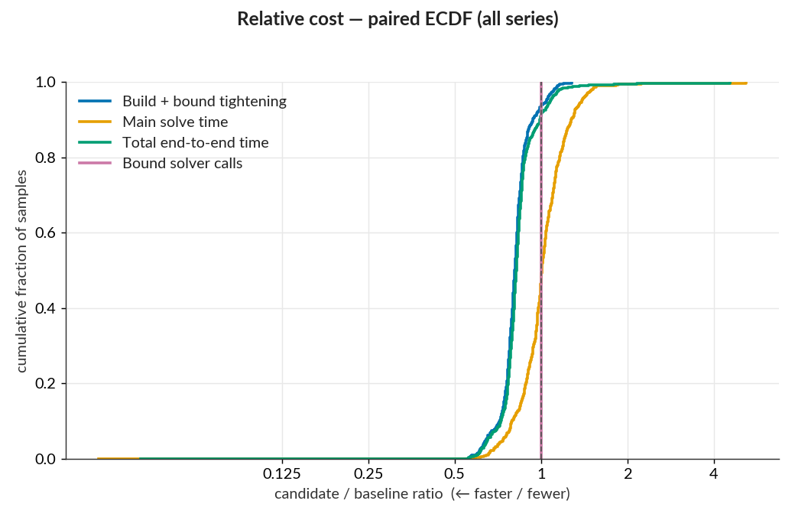
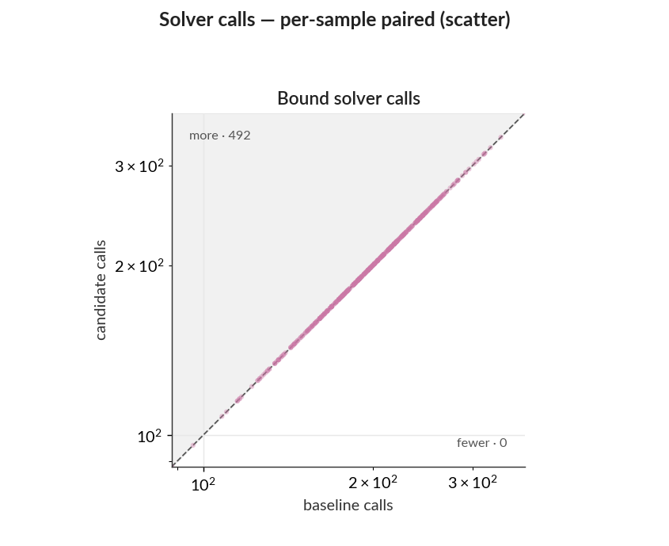

# PR #222 — batched LP certificate dual reads: WK17a LP paired benchmark

PR #222 reads row duals once per homogeneous constraint group when building an LP certificate.
The baseline reads each constraint through `JuMP.dual`. This report measures the change after PR
#209's progressive ReLU tightening, where the remaining certificate overhead matters most.

- Baseline: post-#209 master `8a455e2756a0d45e224bb1da95f2de8dc2ba3df4`
- Candidate: PR #222 `5b407044078c1ea6108b893f8fd81d8d7f5538c3`
- Current PR head: `71e6405`; it differs from the measured candidate only by removing the completed
  benchmark TODO.
- Arguments: `--samples 1:500 --tightening lp --main-time-limit 120 --norm-order Inf`
- Julia 1.12.6, one thread, sequential runs on a local WSL2 workstation
- Identical dependency snapshot:
  `1cfef4c977ff08219a888aa479cb94eea0b3dbc16f654d1fc0a09167c8f1c74a`

Raw per-sample data, tightening rows, ReLU rows, metrics, and dependency snapshots are in
`baseline/` and `candidate/`. The `control/` directory contains a same-commit repeat described
below.

## Summary

- Formulation time fell **18.9%**, from 866.2 s to 702.6 s, saving 163.6 s. A 10,000-resample
  paired input bootstrap gives a 17.6–20.0% interval. This interval measures sensitivity to the
  fixed input mix, not machine-to-machine or run-to-run timing variation.
- Non-solver bound overhead fell **38.6%**, from 299.0 s to 183.5 s, saving 115.5 s. This is bound
  tightening time minus time inside HiGHS. HiGHS bound-solver wall time changed by 0.4 s, and both
  sides made 99,067 bound-solver calls.
- Summed end-to-end sample time fell **6.6%**, from 2,431.7 s to 2,270.7 s, saving 161.0 s across
  500 inputs. Whole-run elapsed time changed by the same 161.0 s. The final verification solves
  were flat in aggregate, so the measured saving came before the final solve.
- The pre-solve improvement was broad: the analyzer's build-and-tightening proxy had a median
  candidate/baseline ratio of 0.81, with 93% of modeled samples improving by more than 1%.
- Final-solve timing and outcomes varied near the 120 s limit. The candidate resolved two inputs
  that were unresolved in the baseline, while no semantic outcome regressed. A same-commit control
  confirms substantial fresh-process HiGHS path variation, so these outcome changes are not used
  to attribute the formulation speedup.

## Component timings

The rows below overlap: formulation contains the bound-tightening and residual rows, while
non-solver bound overhead is derived from bound tightening minus HiGHS wall time.

| measurement                             |  baseline | candidate |   saved | change |
| --------------------------------------- | --------: | --------: | ------: | -----: |
| Whole-run elapsed                       | 2,434.8 s | 2,273.7 s | 161.0 s |   6.6% |
| Summed end-to-end sample time           | 2,431.7 s | 2,270.7 s | 161.0 s |   6.6% |
| Formulation                             |   866.2 s |   702.6 s | 163.6 s |  18.9% |
| Bound-tightening phase                  |   469.6 s |   353.8 s | 115.8 s |  24.7% |
| HiGHS bound-solver wall time            |   170.6 s |   170.2 s |   0.4 s |   0.2% |
| Non-solver bound overhead               |   299.0 s |   183.5 s | 115.5 s |  38.6% |
| Formulation excluding bound-solver time |   695.6 s |   532.4 s | 163.2 s |  23.5% |
| Formulation residual                    |   396.6 s |   348.9 s |  47.7 s |  12.0% |
| Final-solve wall time                   | 1,562.1 s | 1,564.7 s |  −2.6 s |  −0.2% |

The non-solver bound result directly tests issue #211's question. After progressive tightening,
certificate and bound-loop overhead still exceeded time inside HiGHS, and batched reads removed
115.5 s without changing the number of solves.

## Per-sample distribution

The analyzer excludes the eight already-misclassified inputs from ratios, leaving 492 modeled
pairs. Ratios are candidate divided by baseline; values below 1 are faster.

| series                   | median |   p10–p90 | improved by >1% | regressed by >1% | pooled ratio |
| ------------------------ | -----: | --------: | --------------: | ---------------: | -----------: |
| Build + bound tightening |   0.81 | 0.72–0.94 |             93% |               6% |         0.81 |
| Main solve               |   1.01 | 0.79–1.28 |             42% |              49% |         1.00 |
| Total end to end         |   0.82 | 0.72–0.99 |             90% |               8% |         0.93 |
| Bound-solver calls       |   1.00 | 1.00–1.00 |              0% |               0% |         1.00 |

The ten largest absolute movers account for 6% of build-and-tightening movement but 65% of total
movement. Final-solve cutoff behavior therefore dominates end-to-end variance even though the
pre-solve saving is spread across the dataset. A paired input bootstrap for the end-to-end saving
spans −5.2% to 19.3%; it is not a system-performance confidence interval.

## Model and outcome audit

The paired raw rows have identical values for:

- dependency snapshot and benchmark arguments;
- variable, binary-variable, structural-constraint, and total-constraint counts;
- all ReLU classification counts and all non-time ReLU-layer fields;
- bound requests, solver calls, statuses, skips, barrier iterations, and nodes.

Bound simplex iterations differed by 834 out of about 2.72 million (0.031%). The two sides ran in
fresh Julia and HiGHS processes, and their final MIP search paths also differed.

Observed solve-status changes:

- sample 150: `OPTIMAL` → `TIME_LIMIT`; both runs found an adversarial example;
- sample 321: `TIME_LIMIT` → `OPTIMAL`; both runs found an adversarial example;
- sample 407: `TIME_LIMIT` → `INFEASIBLE`; the candidate certified no adversarial example.

Sample 212 remained `TIME_LIMIT`, but the candidate found an incumbent while the baseline was
unresolved. Overall, unresolved timeouts fell from three to one. There were no semantic changes
from a resolved result to an unresolved result.

Of 486 inputs with objective values on both sides, 478 agreed within `1e-6`. The largest differences
were timeout-limited incumbents. Sample 291 was the one large optimal/optimal difference: the full
baseline reported 0.0461418 and the candidate reported 0.0409316. A same-master control reran
samples 9, 291, and 496 in two fresh processes. Both control runs reported 0.0409316 for sample 291,
matching the candidate, and the maximum control objective difference was `5.55e-6`. The control's
three final solves also differed by 11.2 s in aggregate with identical code. These observations are
consistent with fresh-process solver variation, not a semantic regression from batched reads.

## Plots






## Reproduce

From a checkout containing PR #223's benchmark helper:

```sh
benchmarks/run_pair.sh \
  --base 8a455e2756a0d45e224bb1da95f2de8dc2ba3df4 \
  --candidate 5b407044078c1ea6108b893f8fd81d8d7f5538c3 \
  --out /tmp/mipv-issue211-pair \
  --samples 1:500 \
  --tightening lp \
  --main-time-limit 120 \
  --base-label "post-#209 master 8a455e2" \
  --candidate-label "PR #222 5b40704"
```
