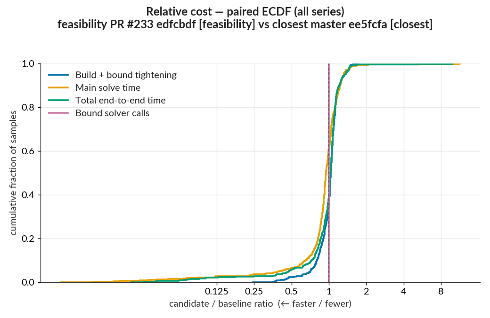
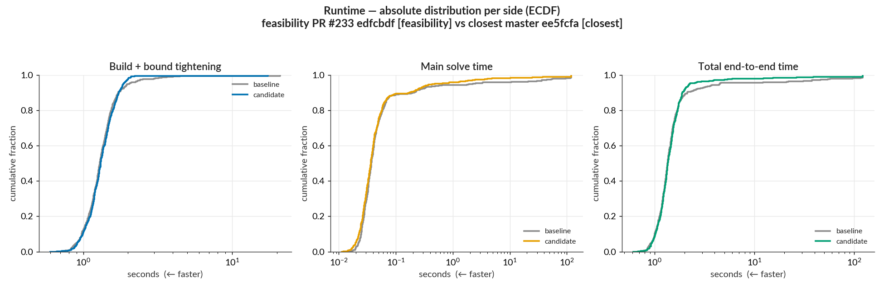
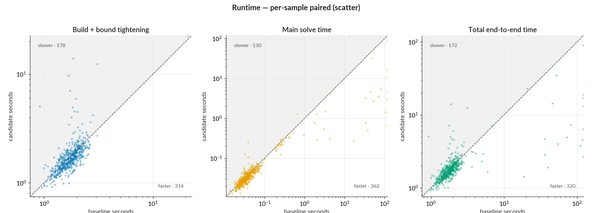

# Performance report: WK17a adversarial-example search, LP tightening, 500 samples

This local paired benchmark measures adversarial-example search on the first 500 MNIST test inputs
with the WK17a network and an L∞ perturbation budget of 0.1. The `closest` baseline minimizes
adversarial distortion. The `feasibility` candidate searches for any adversarial input within the
budget. MIPVerify independently verifies every numeric witness returned by the candidate
implementation.

This fresh pair supersedes the earlier measurement cited for PR #233. It is a cross-objective
comparison of the fixed-budget performance tradeoff. A same-objective code-regression conclusion
is outside its scope.

## Method

- Baseline: master `ee5fcfa267cd664799a90a7d22c7258546e9df1a`, `closest` objective.
- Candidate: PR #233 implementation commit `edfcbdfaa722dde5ef637f900b4845459ac68e8d`,
  `feasibility` objective.
- Harness: `benchmarks/run_pair.sh`, which invoked `benchmarks/benchmark_wk17a_first100.jl` for
  each commit with `--samples 1:500 --tightening lp --main-time-limit 120 --norm-order Inf`. The
  tightening pass uses linear programming (LP), and the final verification problem is a
  mixed-integer program (MIP). `Inf` selects the L∞ norm used to report witness distance.
- Runtime: Julia 1.12.6 with one Julia thread.
- Solver: HiGHS, an open-source LP/MIP solver. Both checkouts used HiGHS.jl 1.23.0 as the Julia
  optimizer interface and HiGHS_jll 1.14.0+0 as the native solver binary.
- Dependencies: excluding the local MIPVerify checkout, both runs resolved the same package
  versions and tree hashes. Their dependency-inventory SHA-256 is
  `041d5744a5121dc615cec747e2f55c74663a4ac563bffab69bb5a314939e1c84`. The captured manifests
  differ only in their top-level `project_hash` because the commits have different
  `benchmarks/Project.toml` files.
- Run discipline: the runner used the same local WSL2 workstation and a fresh process for each
  side. It completed the baseline, then started the candidate about 53 seconds later. The runs
  were sequential.

Raw artifacts are in the [baseline directory](baseline/) and [candidate directory](candidate/).
They include per-sample data, tightening rows, rectified linear unit (ReLU) rows, metrics, and
dependency snapshots. Generated statistics are in
[improvement_stats.md](improvement_stats.md) and [improvement_stats.csv](improvement_stats.csv).

## Sample accounting

Both runs processed 500 inputs. Each side constructed a MIP, performed LP bound tightening, and
invoked the final verification solve for 492 inputs. The other eight inputs were already
misclassified: their original input met the requested attack condition, so both runs returned it
through the original-input fast path without constructing a solver model.

Per-sample ratio distributions use the 492 model-built pairs. The eight fast-path inputs are the
only exclusions. Every input whose solve status or semantic outcome changed built a model on both
sides, so all seven distinct changed inputs remain in the timing population.

The eight fast paths contribute 0.030 s to the baseline and 0.051 s to the candidate. The summed
all-input `Total end-to-end time` is therefore 2,139.591 s → 1,297.437 s, while the 492 model-built
sum is 2,139.561 s → 1,297.386 s.

Rows are paired by `sample_index`, which prevents sample-mix differences from affecting the
ratios. Baseline end-to-end times among the 492 model-built inputs range from 0.669 s to 122.005 s;
candidate times range from 0.615 s to 121.739 s.

## Summary

Summed `Total end-to-end time` over the 492 model-built pairs fell 39.4%, from 2,139.561 s to
1,297.386 s, for a pooled ratio of 0.606. The median per-input ratio was 1.031, so the typical
model-built input was 3.1% slower. Expensive inputs drive the aggregate reduction: the 10 largest
absolute changes account for 74% of total absolute movement.

Using a ±1% band, 186 inputs improved, 21 stayed within the band, and 285 regressed. All 22
candidate witnesses passed both independent checks. Six inputs changed solve status and three
changed semantic outcome, producing seven distinct changed inputs. Every transition involves the
120-second main-solve limit on at least one side.

## Per-sample ratio distribution

Every ratio is candidate ÷ baseline. A ratio below 1 means the candidate used less time or fewer
calls. `Improved` means a ratio below 0.99, `Regressed` means a ratio above 1.01, and `Within ±1%`
includes both boundaries and every value between them.

| per-sample `Total end-to-end time` result |          definition | inputs | share |
| ----------------------------------------- | ------------------: | -----: | ----: |
| Improved                                  |        ratio < 0.99 |    186 | 37.8% |
| Within ±1%                                | 0.99 ≤ ratio ≤ 1.01 |     21 |  4.3% |
| Regressed                                 |        ratio > 1.01 |    285 | 57.9% |

The pooled ratio divides summed candidate time by summed baseline time, which gives expensive
inputs more weight. The median gives each input equal weight. This difference in weighting
explains the pooled ratio of 0.606 and the median ratio of 1.031.

## Aggregate saving and concentration

`Total end-to-end time` is `total_time_seconds`, the full per-input timer covering model
construction, LP bound tightening, and the final MIP solve. `Whole-run elapsed` is the benchmark
script's internal wall timer around the 500-input loop. Dataset and network loading occur before
this timer, and worktree and package setup happen outside the benchmark process.

| measure                               |      population |   `closest` | `feasibility` | candidate / baseline | change |
| ------------------------------------- | --------------: | ----------: | ------------: | -------------------: | -----: |
| Whole-run elapsed                     |         all 500 | 2,143.413 s |   1,300.460 s |                0.607 | −39.3% |
| Summed `Total end-to-end time`        |         all 500 | 2,139.591 s |   1,297.437 s |                0.606 | −39.4% |
| Summed `Total end-to-end time`        | 492 model-built | 2,139.561 s |   1,297.386 s |                0.606 | −39.4% |
| `Build + bound tightening` diagnostic | 492 model-built |     688.6 s |       675.2 s |                0.981 |  −1.9% |
| `Main solve time`                     | 492 model-built |   1,451.0 s |       622.2 s |                0.429 | −57.1% |
| `Bound solver calls`                  | 492 model-built |      99,067 |        99,067 |                1.000 |   0.0% |

Whole-run elapsed exceeds the all-input sum by 3.822 s for the baseline and 3.024 s for the
candidate. Those gaps are run-level work outside the per-input timers. The all-input and
model-built sums differ by the fast-path contributions of 0.030 s and 0.051 s.

The generated artifacts label `total_time_seconds − solve_time_seconds` as
`Build + bound tightening`. Treat this as a diagnostic remainder: it includes model construction,
LP bound tightening, MIPVerify instrumentation, witness verification, and final-solve wrapper
overhead. The plots abbreviate solver-reported `solve_time_seconds` as `Main solve time`. Direct
instrumented bound-tightening time was 337.5 s → 352.4 s, an increase of 14.8 s, or 4.4%.

Solver-reported `Main solve time` supplied 828.7 s of the 842.2 s aggregate end-to-end saving, or
98.4%. `Bound solver calls` remained at 99,067 on both sides.

Top-10 concentration is the sum of the 10 largest absolute per-input end-to-end changes divided by
the sum of all 492 absolute changes. It is 74% for `Total end-to-end time`, showing that a small
number of expensive inputs dominate the aggregate result.

## Solve status and outcome changes

Solve status records how the optimizer stopped. Semantic outcome records the evidence available
afterward. An incumbent is a candidate solution: an incumbent that passes verification counts as
an adversarial example even when the solve reaches `TIME_LIMIT`. Plain `INFEASIBLE` without a
candidate certifies the absence of an adversarial example in the encoded search space.
`TIME_LIMIT` without a candidate is unresolved. `SKIPPED_PREDICTED_IN_TARGETED` is the
original-input fast-path status.

The schema-3 baseline infers candidate availability from a nonmissing `objective_value`. The
schema-6 candidate records availability and the independent witness-verification fields directly.

| solve status                    | `closest` | `feasibility` |
| ------------------------------- | --------: | ------------: |
| `INFEASIBLE`                    |       476 |           474 |
| `OPTIMAL`                       |        10 |            14 |
| `SKIPPED_PREDICTED_IN_TARGETED` |         8 |             8 |
| `TIME_LIMIT`                    |         6 |             4 |

Six inputs changed solve status:

| transition                  |   n | samples            |
| --------------------------- | --: | ------------------ |
| `INFEASIBLE` → `TIME_LIMIT` |   2 | 19, 46             |
| `TIME_LIMIT` → `OPTIMAL`    |   4 | 150, 242, 446, 480 |

Three inputs changed semantic outcome:

| transition                                                          |   n | samples |
| ------------------------------------------------------------------- | --: | ------- |
| `certified_no_adversarial_example` → `time_limit_unresolved`        |   2 | 19, 46  |
| `adversarial_example_found_or_best_known` → `time_limit_unresolved` |   1 | 212     |

The union of both change sets contains seven inputs:

| sample | solve status, `closest` → `feasibility` | semantic outcome, `closest` → `feasibility`                                           |
| -----: | --------------------------------------- | ------------------------------------------------------------------------------------- |
|     19 | `INFEASIBLE` → `TIME_LIMIT`             | `certified_no_adversarial_example` → `time_limit_unresolved`                          |
|     46 | `INFEASIBLE` → `TIME_LIMIT`             | `certified_no_adversarial_example` → `time_limit_unresolved`                          |
|    150 | `TIME_LIMIT` → `OPTIMAL`                | `adversarial_example_found_or_best_known` → `adversarial_example_found_or_best_known` |
|    212 | `TIME_LIMIT` → `TIME_LIMIT`             | `adversarial_example_found_or_best_known` → `time_limit_unresolved`                   |
|    242 | `TIME_LIMIT` → `OPTIMAL`                | `adversarial_example_found_or_best_known` → `adversarial_example_found_or_best_known` |
|    446 | `TIME_LIMIT` → `OPTIMAL`                | `adversarial_example_found_or_best_known` → `adversarial_example_found_or_best_known` |
|    480 | `TIME_LIMIT` → `OPTIMAL`                | `adversarial_example_found_or_best_known` → `adversarial_example_found_or_best_known` |

Samples 150, 242, 446, and 480 already had incumbents in the `closest` run, so terminating
`OPTIMAL` under `feasibility` did not change their semantic outcome. Sample 212 remains at
`TIME_LIMIT`; only the baseline has an incumbent.

## Witness audit

The feasibility run produced 22 numeric witnesses: 14 from solver-backed models and eight from the
original-input fast path. Every available candidate passed verification.

| candidate witness check                  | passed | failed |
| ---------------------------------------- | -----: | -----: |
| Numeric candidate available              |     22 |    N/A |
| Requested target and margin              |     22 |      0 |
| Built-in perturbation-family constraints |     22 |      0 |
| Both independent checks                  |     22 |      0 |

The perturbation check validates shape, finite values, pixel range, and the L∞ budget of 0.1
against the original input. The baseline uses benchmark schema version 3, which predates numeric
witness fields, so the table applies directly to the candidate.

## Limitations

- The pair compares `closest` with `feasibility` and measures their fixed-budget performance
  tradeoff. Same-objective implementation regressions remain unmeasured.
- Each objective ran once in sequential order. Run-to-run variance remains unmeasured.
- Every changed solve status or semantic outcome involves the 120-second main-solve limit on at
  least one side. Individual transitions may vary with solver search order and workstation timing
  near the cap.
- Performance results apply to the repository-pinned HiGHS stack. Other optimizers remain
  unmeasured.
- The runs used the same local WSL2 workstation. Hardware details are absent from the artifacts.

## Rerun the pair

Activate Julia 1.12.6 before running the command. The environment prefix enforces the recorded
single-thread setting.

```sh
JULIA_NUM_THREADS=1 benchmarks/run_pair.sh \
  --base ee5fcfa267cd664799a90a7d22c7258546e9df1a \
  --candidate edfcbdfaa722dde5ef637f900b4845459ac68e8d \
  --out /tmp/mipv-pr233-feasibility-pair \
  --samples 1:500 \
  --tightening lp \
  --main-time-limit 120 \
  --norm-order Inf \
  --candidate-objective feasibility \
  --base-label "closest master ee5fcfa" \
  --candidate-label "feasibility PR #233 edfcbdf"
```

Master `ee5fcfa` predates the objective selector and its benchmark uses `closest` by default, so the
command omits a baseline-objective flag. The runner creates a worktree for each commit, develops
that checkout's local MIPVerify package, and installs the exact HiGHS versions listed above on both
sides before running them sequentially. Timings can differ on other hardware and across repeated
runs.

## Plots

The paired empirical cumulative distribution function (ECDF) plots candidate ÷ baseline ratios
for the 492 model-built inputs. Values left of 1 indicate lower candidate cost. The midpoint of the
`Total end-to-end time` curve is the median ratio of 1.031.



The candidate `Main solve time` distribution has a shorter upper tail. Four candidate main solves
hit the 120-second limit; their `Total end-to-end time` values are slightly higher because they
include construction, tightening, MIPVerify instrumentation, witness verification, and wrapper
overhead.



Each point is one input. The dashed diagonal marks equal candidate and baseline time. In the
`Total end-to-end time` panel, 194 pairs are strictly below the diagonal and 298 are above it.
Among the 10 largest absolute `Total end-to-end time` changes, eight are faster and two regress:
samples 19 and 46. For both regressions, the baseline certifies infeasibility while the candidate
reaches `TIME_LIMIT`. These strict diagonal counts use no tolerance, so they differ from the ±1%
table.


