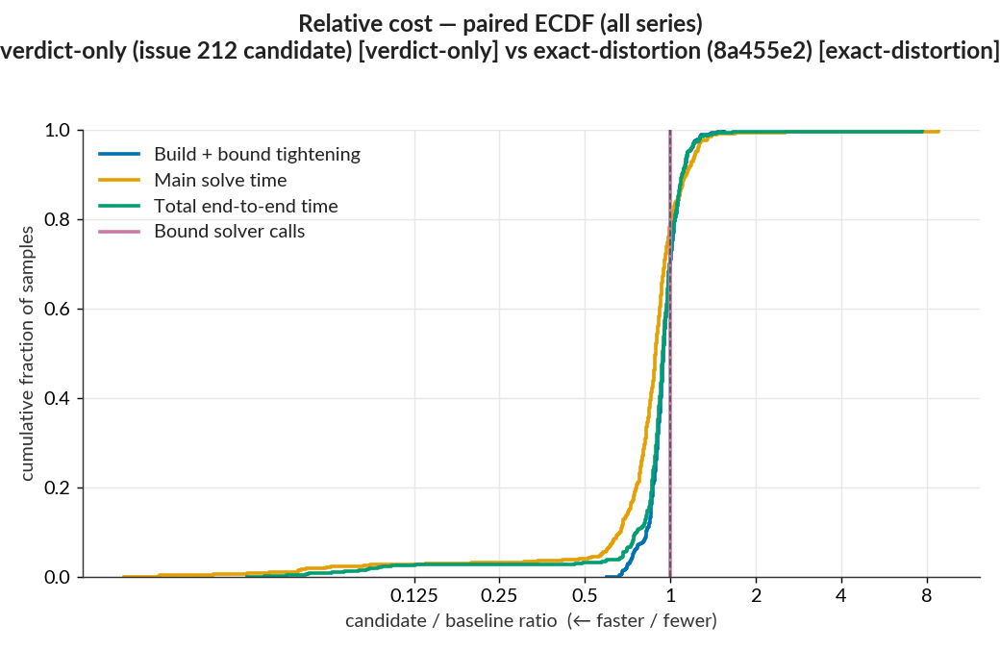
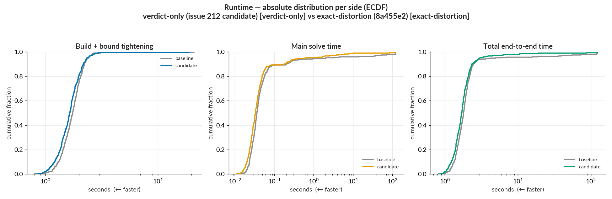
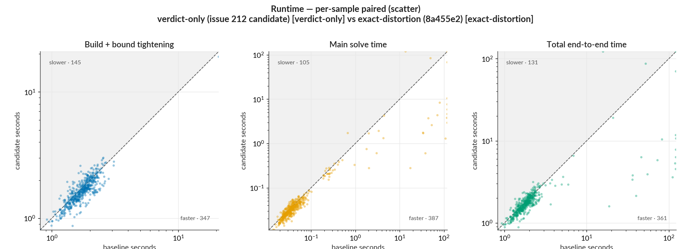
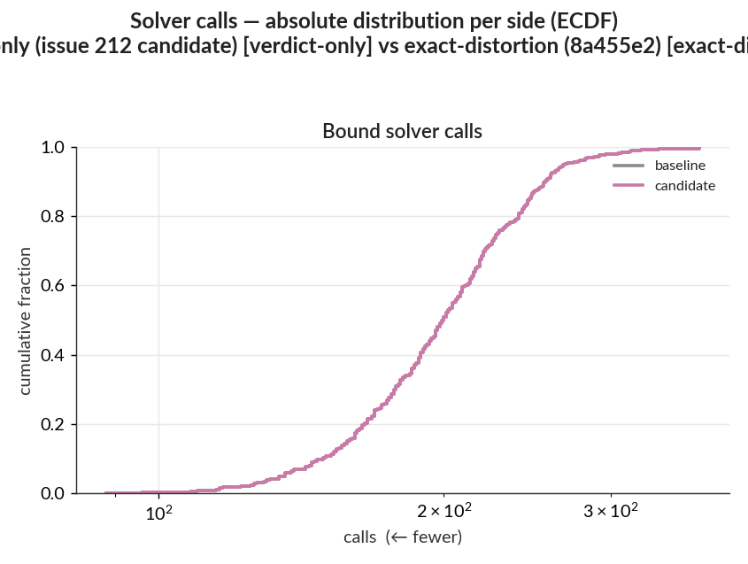
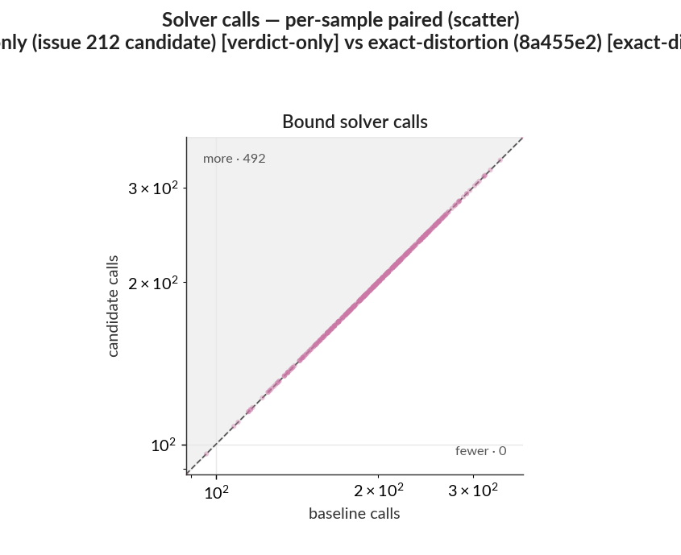

# PR #233 — verdict-only mode: WK17a LP paired benchmark

This benchmark compares the new fixed-budget verdict path with the previous exact-distortion
default. The solve goals differ intentionally: the baseline minimizes adversarial distortion, while
the candidate asks only whether a feasible adversarial example exists. Raw per-sample data,
tightening rows, ReLU rows, metrics, and dependency snapshots are in `baseline/` and `candidate/`.

- Baseline: master `8a455e2756a0d45e224bb1da95f2de8dc2ba3df4`, exact-distortion mode.
- Candidate: PR #233 `009e76a88fc673917c4e7e1311034ad36a0a5494`, verdict-only mode.
- Arguments: `--samples 1:500 --tightening lp --main-time-limit 120 --norm-order Inf`.
- Julia 1.12.6, HiGHS, one Julia thread, identical dependency snapshot
  `1cfef4c977ff08219a888aa479cb94eea0b3dbc16f654d1fc0a09167c8f1c74a`.
- Both runs used the same local workstation. The baseline was a same-day reusable run completed
  about eight hours before the candidate, rather than an interleaved control.

## Summary

- Whole-run elapsed time fell **45.5%**, from 2,434.8 s to 1,328.1 s. Summed per-sample time fell
  by the same proportion, from 2,431.7 s to 1,324.9 s.
- Summed main-solver time fell **68.6%**, from 1,549.0 s to 485.7 s. The 10 largest per-sample
  changes account for 77% of the absolute main-solve movement, so the aggregate gain is
  concentrated in expensive inputs.
- Across 492 modeled pairs, the median total-time ratio was 0.94. Using a ±1% band, 70% improved
  and 26% regressed. The pooled total ratio was 0.54 because verdict-only shortens several of the
  longest solves.
- Bound-solver calls were identical at 99,067. Build and bound-tightening time had a median ratio
  of 0.95, but that stage is unchanged in substance and the non-interleaved setup cannot attribute
  its 43 s aggregate difference to verdict-only mode.
- Unresolved timeouts fell from 3 to 2. Three semantic outcomes changed near the 120 s limit: one
  exact robustness certificate became unresolved, one unresolved input gained a verified witness,
  and one unresolved input gained a robustness certificate.
- The candidate had 15 solver-backed witnesses and verified all 15 by forwarding the proposed
  input through the numeric network. The eight already-misclassified inputs also verified. There
  were **no available-but-unverified witnesses**.

## Detailed statistics

### Plots

The relative distribution shows the largest shift in main-solve time. Build and tightening stay
near parity, while bound-solver call counts are exactly unchanged.



The absolute view shows verdict-only removing much of the long main-solve tail. Two candidate
inputs still reach the 120 s limit.



Most expensive main solves lie below the parity line. Sample 19 is the material opposite case: the
exact baseline proved infeasibility, while the candidate reached the time limit.



The bound-call plots overlap because both modes perform the same LP tightening work.





### Per-sample ratio distribution

Ratios are candidate divided by baseline; values below 1 are faster. The analyzer excludes the
eight already-misclassified inputs, leaving 492 modeled pairs.

| series | n | min | p10 | p25 | median | p75 | p90 | max | improved | regressed |
|---|--:|--:|--:|--:|--:|--:|--:|--:|--:|--:|
| Build + bound tightening | 492 | 0.59 | 0.82 | 0.89 | 0.95 | 1.02 | 1.10 | 1.54 | 67% | 27% |
| Main solve time | 492 | 0.01 | 0.67 | 0.79 | 0.89 | 0.98 | 1.13 | 8.81 | 77% | 20% |
| Total end-to-end time | 492 | 0.03 | 0.76 | 0.88 | 0.94 | 1.01 | 1.10 | 7.71 | 70% | 26% |
| Bound solver calls | 492 | 1.00 | 1.00 | 1.00 | 1.00 | 1.00 | 1.00 | 1.00 | 0% | 0% |

`improved` and `regressed` use a ±1% band. `Total end-to-end time` is model construction, bound
tightening, and the final verification solve.

### Aggregate saving and concentration

| series | baseline | candidate | net saved | pooled ratio | top-10 concentration |
|---|--:|--:|--:|--:|--:|
| Build + bound tightening | 883 s | 839 s | +43 s | 0.95 | 9% |
| Main solve time | 1,549 s | 486 s | +1,063 s | 0.31 | 77% |
| Total end-to-end time | 2,432 s | 1,325 s | +1,107 s | 0.54 | 72% |
| Bound solver calls | 99,067 | 99,067 | 0 | 1.00 | — |

`net saved` is baseline minus candidate. `top-10 concentration` is the share of total absolute
per-sample movement contributed by the 10 largest changes.

### Solve status and outcome audit

| status | exact distortion | verdict only |
|---|--:|--:|
| `INFEASIBLE` | 475 | 475 |
| `OPTIMAL` | 10 | 15 |
| `SKIPPED_PREDICTED_IN_TARGETED` | 8 | 8 |
| `TIME_LIMIT` | 7 | 2 |

Solve-status changes:

| transition | n | samples |
|---|--:|---|
| `TIME_LIMIT` → `OPTIMAL` | 5 | 212, 242, 321, 446, 480 |
| `INFEASIBLE` → `TIME_LIMIT` | 1 | 19 |
| `TIME_LIMIT` → `INFEASIBLE` | 1 | 407 |

Semantic-outcome changes:

| transition | n | samples |
|---|--:|---|
| robustness certificate → unresolved time limit | 1 | 19 |
| unresolved time limit → verified adversarial witness | 1 | 212 |
| unresolved time limit → robustness certificate | 1 | 407 |

The other four `TIME_LIMIT` → `OPTIMAL` changes already had incumbents in the exact run, so their
adversarial verdict did not change. Objective values are not compared because verdict-only solves a
feasibility problem rather than minimizing distortion.

## Limitations

- This is a cross-mode performance comparison, not a same-objective code regression benchmark.
- The same-day baseline was reused rather than rerun immediately before the candidate. Formulation
  timing differences and individual results near the 120 s limit include fresh-process and
  workstation variation.
- Gurobi was unavailable locally. The benchmark exercises HiGHS, while unit tests cover downstream
  `SOLUTION_LIMIT` and `OBJECTIVE_LIMIT` classification without depending on either status for
  verdict-only behavior.

## Reproduce

From a checkout containing PR #233's paired-run helper:

```sh
benchmarks/run_pair.sh \
  --base 8a455e2756a0d45e224bb1da95f2de8dc2ba3df4 \
  --candidate 009e76a88fc673917c4e7e1311034ad36a0a5494 \
  --out /tmp/mipv-pr233-verdict-pair \
  --samples 1:500 \
  --tightening lp \
  --main-time-limit 120 \
  --candidate-mode verdict-only \
  --base-label "exact distortion 8a455e2" \
  --candidate-label "verdict only PR #233"
```

The base mode flag is omitted because commit `8a455e2` predates the mode argument and its benchmark
default is exact distortion.
