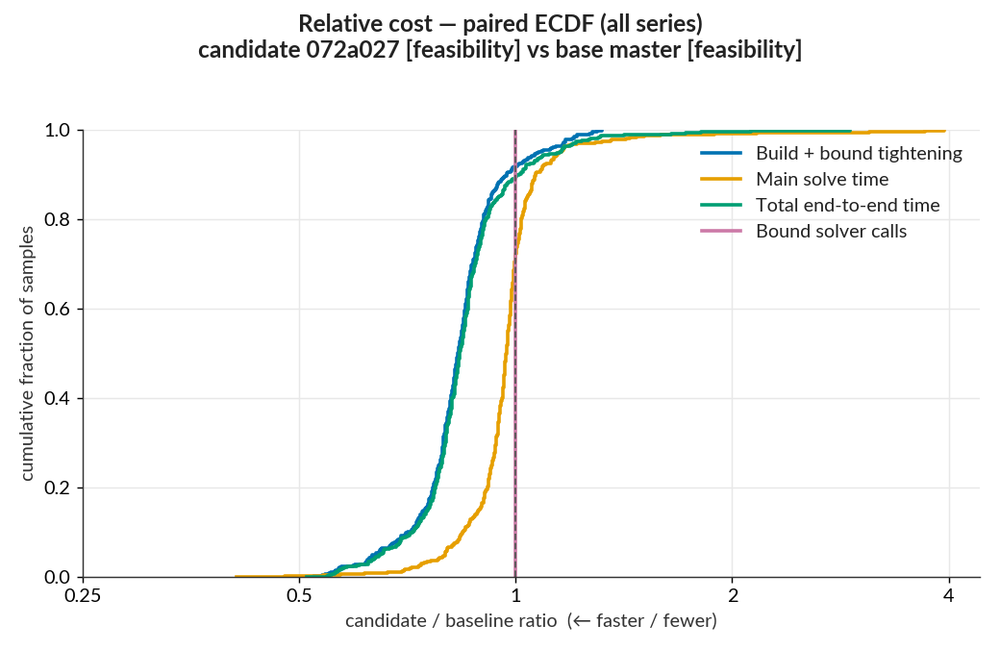
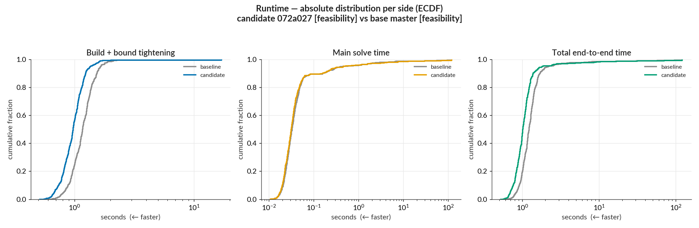
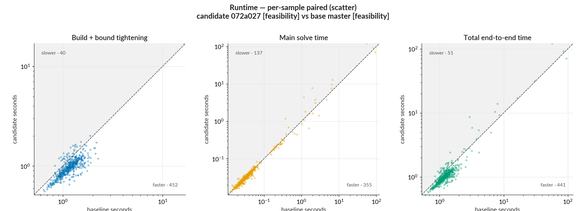
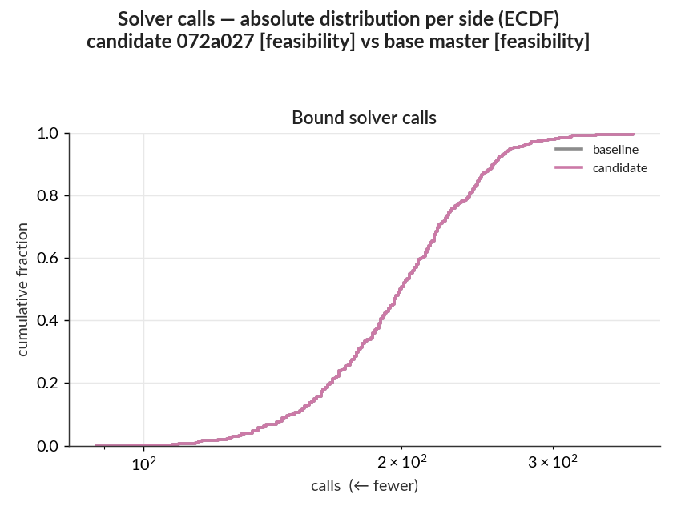
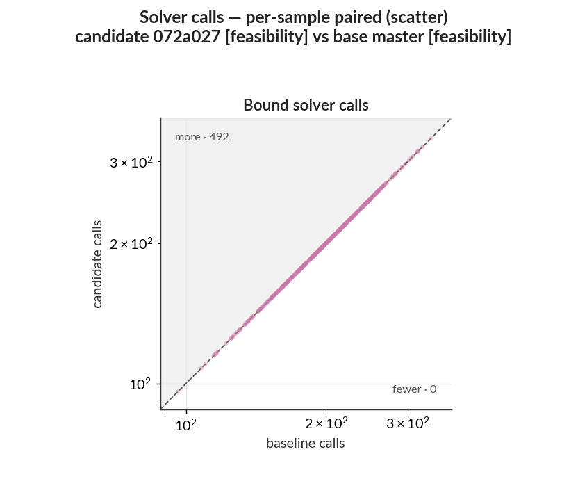

# Performance report: WK17a, LP tightening, 500 samples

This PR caches the affine constraint list that `certified_lp_bound` rebuilds on every LP bound
solve, which should cut formulation time without changing the model handed to the solver.

Samples `1:500` of the MNIST test set are verified against `MNIST.WK17a_linf0.1_authors` on the
baseline and candidate commits under identical non-objective settings; both sides use the
`feasibility` objective, which searches for any verified witness inside the fixed L-infinity budget.
The ratio distributions, scatter plots, and outcome-flip tables compare each sample's candidate run
with its own baseline run, while the absolute-runtime distributions summarize each side separately.
The published `pairs/2026-07-27-cache-affine-constraint-list/` folder holds the raw per-sample CSVs,
the ReLU-layer and tightening CSVs, dependency snapshots for both sides, the statistics files, and
the plots.

- **Baseline** `master` `4f1ed43`; **candidate** `perf/cache-affine-constraint-list` `072a027`.

| run                             | adversarial-example objective |
| ------------------------------- | ----------------------------- |
| base master [feasibility]       | `feasibility`                 |
| candidate 072a027 [feasibility] | `feasibility`                 |

- Command:
  `benchmarks/run_pair.sh --base master --candidate 072a027 --out /tmp/pair-cache --samples 1:500 --tightening lp --main-time-limit 120 --norm-order Inf --base-objective feasibility --candidate-objective feasibility`.
  Julia `1.12.6`, single-threaded; HiGHS (an open-source LP/MIP solver) for all solves; sequential
  runs on a local WSL2 workstation, identical dependency snapshots on both sides (HiGHS.jl 1.23.0,
  HiGHS_jll 1.14.0+0). Absolute times are not comparable to the CI-hosted `benchmark-results`
  series.

---

## Summary

- Both sides solve the same `feasibility` problem, so these timings are a same-work speedup rather
  than a solve-goal tradeoff.
- The change lands entirely in `Build + bound tightening`: 602 s → 502 s, a saving of 100 s at a
  pooled ratio of 0.83 and a median of 0.83, with 91% of samples improved and 8% regressed. Its
  top-10 concentration is 7%, so the gain is spread across the cohort instead of coming from a few
  large samples.
- `Main solve time` is the unaffected phase. Its median is 0.97, near 1.00 as expected for a change
  that alters only how the certificate reads the model. Its aggregate moved the other way, 451 s →
  514 s, with a 94% top-10 concentration: a handful of samples near the 120 s limit dominate that
  number, and it is noise rather than a regression.
- `Total end-to-end time` therefore splits: a 0.84 median that reflects the formulation saving, and
  a 0.97 pooled ratio diluted by those same main-solve movers.
- Bound solver calls are unchanged at 99,067 on both sides. The change removes redundant listing of
  constraints, never a solve.
- One sample changed solve status: 480 went `OPTIMAL` → `TIME_LIMIT`, and its semantic outcome went
  `adversarial_example_found_or_best_known` → `time_limit_unresolved`. That is a net regression of
  one resolved sample, at the time limit.

## Detailed statistics

### Plots

The paired ratio curve for `Build + bound tightening` sits well left of 1.0 across almost the whole
cohort, while `Main solve time` hugs the diagonal — the shift is concentrated in formulation.



The absolute runtime curves separate in the low-cost region where most samples live, and converge in
the expensive tail that the main solve dominates.



Points lie below the `y = x` diagonal throughout the formulation series; the scattered points above
it belong to the main-solve series near the time limit.



The bound-call curves lie on top of each other, confirming that no solve was added or removed.





### Per-sample ratio distribution

| series                   |   n |  min |  p10 |  p25 | median |  p75 |  p90 |  max | improved | regressed |
| ------------------------ | --: | ---: | ---: | ---: | -----: | ---: | ---: | ---: | -------: | --------: |
| Build + bound tightening | 492 | 0.51 | 0.71 | 0.78 |   0.83 | 0.89 | 0.97 | 1.32 |      91% |        8% |
| Main solve time          | 492 | 0.41 | 0.84 | 0.93 |   0.97 | 1.01 | 1.06 | 3.94 |      65% |       24% |
| Total end-to-end time    | 492 | 0.51 | 0.72 | 0.79 |   0.84 | 0.89 | 1.00 | 2.91 |      89% |       10% |
| Bound solver calls       | 492 | 1.00 | 1.00 | 1.00 |   1.00 | 1.00 | 1.00 | 1.00 |       0% |        0% |

- `ratio` = candidate ÷ baseline, < 1 = candidate faster; `improved` counts ratio below 0.99,
  `regressed` counts ratio above 1.01, samples within the ±1% band count as unchanged.
- `build` = constructing the MIP model; `tightening` = the `lp` bound-tightening pass; `main solve` =
  the final verification MIP.
- `total` = `build` + `tightening` + `main solve`.
- `bound solver calls` = count of HiGHS bound-tightening solves.
- `n` = eligible paired inputs for that series after the C3 filters; use each row's emitted value.

### Aggregate saving and concentration

| series                   |    baseline |   candidate | net saved | pooled ratio | top-10 concentration |
| ------------------------ | ----------: | ----------: | --------: | -----------: | -------------------: |
| Build + bound tightening |       602 s |       502 s |    +100 s |         0.83 |                   7% |
| Main solve time          |       451 s |       514 s |     −64 s |         1.14 |                  94% |
| Total end-to-end time    |      1053 s |      1017 s |     +36 s |         0.97 |                  50% |
| Bound solver calls       | 99067 calls | 99067 calls |  +0 calls |         1.00 |                   0% |

- `net saved` = baseline − candidate total; positive = candidate cheaper.
- `pooled ratio` = candidate total ÷ baseline total (aggregate counterpart to the per-sample
  median).
- `top-10 concentration` = the 10 samples with the largest absolute change account for this share of
  the total absolute per-sample change (0–100%; higher = a few samples dominate).

### Solve status and verdict flips

| status                        | base master `4f1ed43` [feasibility] | candidate `072a027` [feasibility] |
| ----------------------------- | ----------------------------------: | --------------------------------: |
| INFEASIBLE                    |                                 476 |                               476 |
| OPTIMAL                       |                                  15 |                                14 |
| SKIPPED_PREDICTED_IN_TARGETED |                                   8 |                                 8 |
| TIME_LIMIT                    |                                   1 |                                 2 |

One sample changed solve status and the same sample changed semantic outcome; the two sets are
identical.

Solve status:

| transition               |   n | samples |
| ------------------------ | --: | ------- |
| `OPTIMAL` → `TIME_LIMIT` |   1 | 480     |

Semantic outcome:

| transition                                                          |   n | samples |
| ------------------------------------------------------------------- | --: | ------- |
| `adversarial_example_found_or_best_known` → `time_limit_unresolved` |   1 | 480     |

#### Model and outcome audit

The paired raw rows have identical values for:

- dependency snapshot and benchmark arguments;
- variable, binary-variable, and constraint counts;
- ReLU classification counts across all 1,476 layer rows;
- bound requests, solver calls, statuses, and skips.

The witness fields differ on 15 samples: `witness_output`, `perturbed_input_value`, and
`witness_margin` record different adversarial examples for the same model. This change cannot alter
the model, and the identical ReLU classifications confirm the bounds are unchanged, so these are
fresh-process solver-path differences rather than a semantic effect.

A same-commit control run in this session measured `master` against itself. It produced a median
ratio of 0.95 on `Build + bound tightening`, a pooled main-solve ratio of 0.91, and one solve-status
flip of its own with no code change at all.

The measured median here is 0.83, a 17% saving against a perfect 1.00. The control landed at 0.95
rather than 1.00, so this benchmark moves by roughly 5 points with no code change — and that
movement can go either way. If the true no-change value is 0.95, the saving is 13%. If it is 1.05,
the saving is 21%. So the saving is 17% with about 4 points of uncertainty in each direction, and one
control run cannot narrow that range. The sample-480 flip is within what identical code already
produced. Issue #276 tracks the benchmark-ordering question this raises.

## Reproduce

```sh
benchmarks/analysis/analyze_pair.py --baseline base --candidate candidate --out analysis \
  --baseline-label "base master" --candidate-label "candidate 072a027"
```
