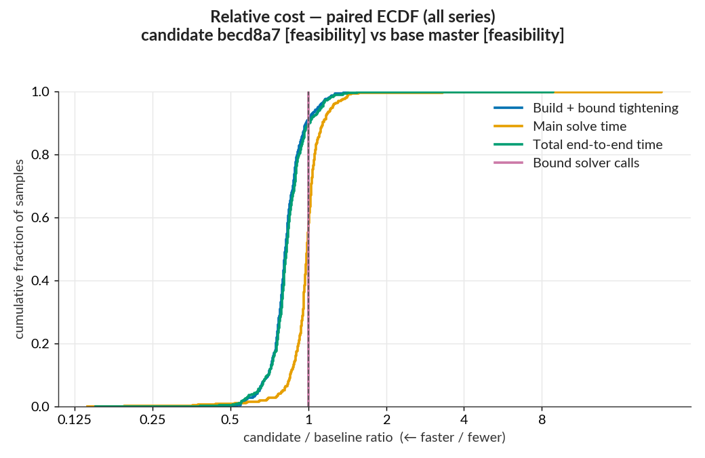
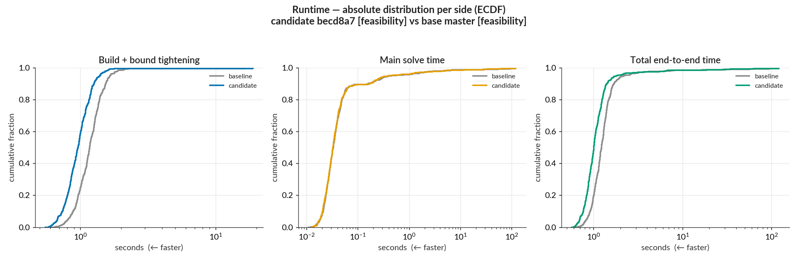
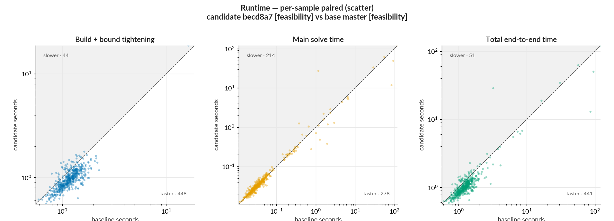
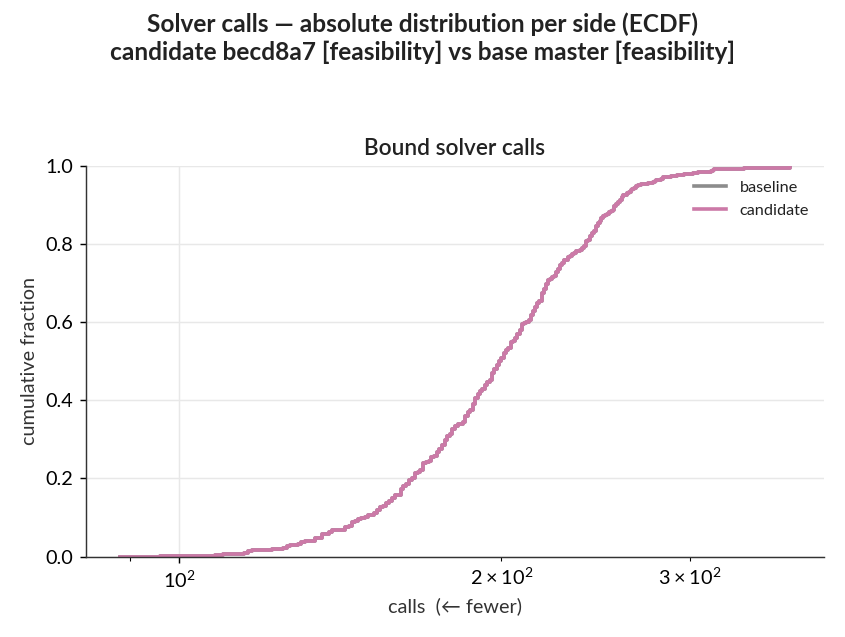
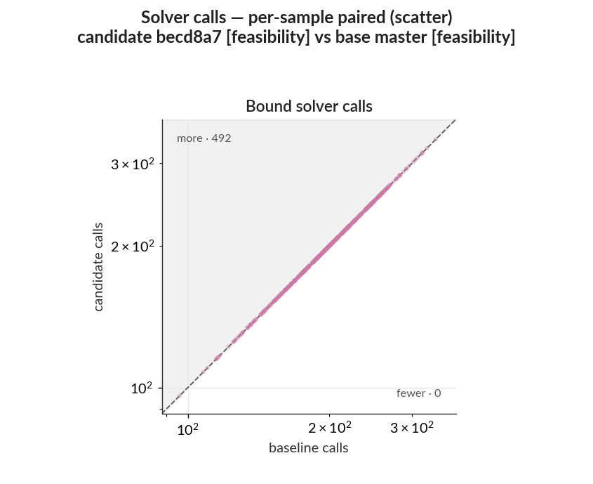

# Performance report: WK17a, LP tightening, 500 samples

This PR relaxes integrality once around all eighteen logit bound solves instead of once per solve,
which should cut formulation time without changing which solves run.

Samples `1:500` of the MNIST test set are verified against `MNIST.WK17a_linf0.1_authors` on the
baseline and candidate commits under identical non-objective settings; both sides use the
`feasibility` objective, which searches for any verified witness inside the fixed L-infinity budget.
The ratio distributions, scatter plots, and outcome-flip tables compare each sample's candidate run
with its own baseline run, while the absolute-runtime distributions summarize each side separately.
The published `pairs/2026-07-27-hoist-integrality-relaxation/` folder holds the raw per-sample CSVs,
the ReLU-layer and tightening CSVs, dependency snapshots for both sides, the statistics files, and
the plots.

- **Baseline** `master` `4f1ed43`; **candidate** `perf/hoist-integrality-relaxation` `becd8a7`.

| run                             | adversarial-example objective |
| ------------------------------- | ----------------------------- |
| base master [feasibility]       | `feasibility`                 |
| candidate becd8a7 [feasibility] | `feasibility`                 |

- Command:
  `benchmarks/run_pair.sh --base master --candidate becd8a7 --out /tmp/pair-integrality --samples 1:500 --tightening lp --main-time-limit 120 --norm-order Inf --base-objective feasibility --candidate-objective feasibility`.
  Julia `1.12.6`, single-threaded; HiGHS (an open-source LP/MIP solver) for all solves; sequential
  runs on a local WSL2 workstation, identical dependency snapshots on both sides (HiGHS.jl 1.23.0,
  HiGHS_jll 1.14.0+0). Absolute times are not comparable to the CI-hosted `benchmark-results`
  series.

_This candidate shares its baseline run with the report for the constraint-list cache; the two
changes were measured in one session against one baseline._

---

## Summary

- Both sides solve the same `feasibility` problem, so these timings are a same-work speedup rather
  than a solve-goal tradeoff.
- The change lands entirely in `Build + bound tightening`: 602 s → 501 s, a saving of 102 s at a
  pooled ratio of 0.83 and a median of 0.82, with 91% of samples improved and 9% regressed. Its
  top-10 concentration is 8%, so the gain is spread across the cohort.
- No sample changed solve status, and no sample changed semantic outcome. Every verdict matches the
  baseline.
- `Main solve time` is the unaffected phase. Its median is 0.99, as expected for a change that
  touches only formulation. Its aggregate moved 451 s → 362 s with a 96% top-10 concentration, which
  is a few samples near the 120 s limit rather than an effect of this change.
- `Total end-to-end time` reports 1053 s → 862 s at a 0.82 pooled ratio, but that figure inherits
  the main-solve movement above and therefore overstates what this change is responsible for. The
  0.83 median and the formulation row are the attributable numbers.
- Bound solver calls are unchanged at 99,067 on both sides. The change alters when integrality is
  relaxed, never which solves run.

## Detailed statistics

### Plots

The paired ratio curve for `Build + bound tightening` sits left of 1.0 across nearly the whole
cohort, while `Main solve time` stays centred on it.



The absolute runtime curves separate across the bulk of the cohort and converge only in the
expensive tail.



Formulation points sit below the `y = x` diagonal throughout; the widely scattered points on both
sides of it are main-solve samples near the time limit.



The bound-call curves coincide, confirming that no solve was added or removed.





### Per-sample ratio distribution

| series                   |   n |  min |  p10 |  p25 | median |  p75 |  p90 |   max | improved | regressed |
| ------------------------ | --: | ---: | ---: | ---: | -----: | ---: | ---: | ----: | -------: | --------: |
| Build + bound tightening | 492 | 0.45 | 0.70 | 0.77 |   0.82 | 0.89 | 0.98 |  1.42 |      91% |        9% |
| Main solve time          | 492 | 0.14 | 0.85 | 0.94 |   0.99 | 1.04 | 1.14 | 23.23 |      50% |       39% |
| Total end-to-end time    | 492 | 0.15 | 0.70 | 0.77 |   0.83 | 0.90 | 1.01 |  8.86 |      89% |       10% |
| Bound solver calls       | 492 | 1.00 | 1.00 | 1.00 |   1.00 | 1.00 | 1.00 |  1.00 |       0% |        0% |

- `ratio` = candidate ÷ baseline, < 1 = candidate faster; `improved` counts ratio below 0.99,
  `regressed` counts ratio above 1.01, samples within the ±1% band count as unchanged.
- `build` = constructing the MIP model; `tightening` = the `lp` bound-tightening pass; `main solve` =
  the final verification MIP.
- `total` = `build` + `tightening` + `main solve`.
- `bound solver calls` = count of HiGHS bound-tightening solves.
- `n` = eligible paired inputs for that series after the C3 filters; use each row's emitted value.

### Aggregate saving and concentration

| series                   |    baseline |   candidate | net saved | pooled ratio | top-10 concentration |
| ------------------------ | ----------: | ----------: | --------: | -----------: | -------------------: |
| Build + bound tightening |       602 s |       501 s |    +102 s |         0.83 |                   8% |
| Main solve time          |       451 s |       362 s |     +89 s |         0.80 |                  96% |
| Total end-to-end time    |      1053 s |       862 s |    +191 s |         0.82 |                  58% |
| Bound solver calls       | 99067 calls | 99067 calls |  +0 calls |         1.00 |                   0% |

- `net saved` = baseline − candidate total; positive = candidate cheaper.
- `pooled ratio` = candidate total ÷ baseline total (aggregate counterpart to the per-sample
  median).
- `top-10 concentration` = the 10 samples with the largest absolute change account for this share of
  the total absolute per-sample change (0–100%; higher = a few samples dominate).

The end-to-end top-10 concentration of 58% is carried by the same samples that dominate the
main-solve row. Because this change cannot affect the main solve, the 191 s end-to-end saving should
not be attributed to it; the 102 s formulation saving is the defensible figure.

### Solve status and verdict flips

| status                        | base master `4f1ed43` [feasibility] | candidate `becd8a7` [feasibility] |
| ----------------------------- | ----------------------------------: | --------------------------------: |
| INFEASIBLE                    |                                 476 |                               476 |
| OPTIMAL                       |                                  15 |                                15 |
| SKIPPED_PREDICTED_IN_TARGETED |                                   8 |                                 8 |
| TIME_LIMIT                    |                                   1 |                                 1 |

No sample changed solve status and no sample changed semantic outcome, so the two sets are both
empty.

Solve status:

_None._

Semantic outcome:

_None._

#### Model and outcome audit

A same-commit control run in this session measured `master` against itself and produced a median
ratio of 0.95 on `Build + bound tightening`, along with one solve-status flip and no code change.

The measured median here is 0.82, an 18% saving against a perfect 1.00. The control landed at 0.95
rather than 1.00, so this benchmark moves by roughly 5 points with no code change — and that
movement can go either way. If the true no-change value is 0.95, the saving is 14%. If it is 1.05,
the saving is 22%. So the saving is 18% with about 4 points of uncertainty in each direction, and one
control run cannot narrow that range. Issue #276 tracks the benchmark-ordering question this
raises.

## Reproduce

```sh
benchmarks/analysis/analyze_pair.py --baseline base --candidate candidate --out analysis \
  --baseline-label "base master" --candidate-label "candidate becd8a7"
```
