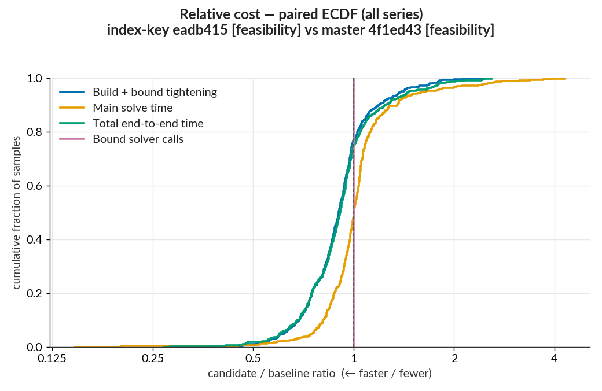
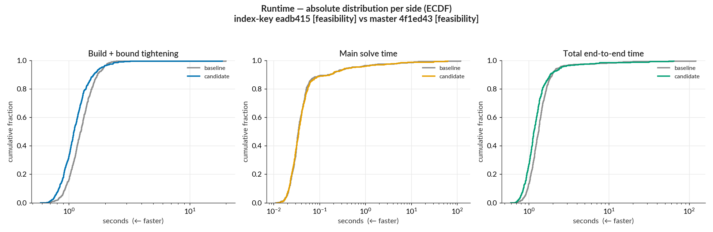
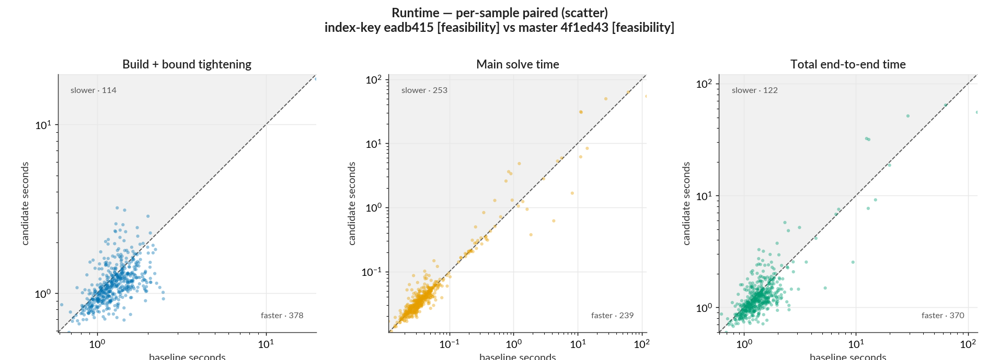
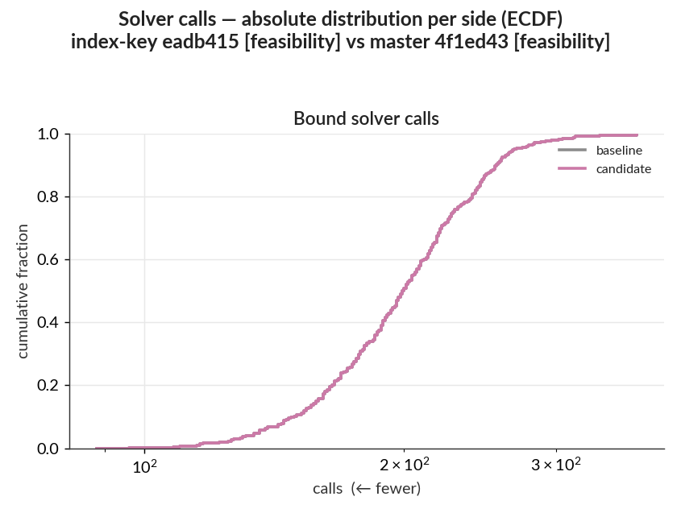
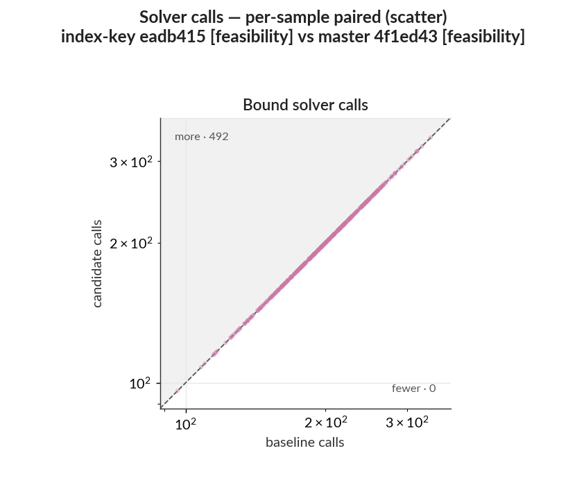

# Performance report: WK17a, LP tightening, 500 samples

#277 caches the affine constraint list that the LP bound certificate enumerates on every bound solve, which lowers formulation time and leaves every solved model unchanged.

Samples `1:500` of the MNIST test set are verified against `MNIST.WK17a_linf0.1_authors` on the baseline and candidate commits under identical non-objective settings. Both sides use the `feasibility` adversarial-example objective, which searches for any verified witness inside the fixed budget. The ratio distributions, scatter plots, and outcome-flip tables compare each sample's candidate run with its own baseline run; the absolute-runtime distributions summarize each side separately. The `pairs/2026-07-27-pr277-index-key-wk17a-lp/` folder on the `benchmark-reports` branch holds the raw per-sample CSVs for both sides, the per-layer ReLU CSVs, the dependency snapshots, the statistics tables, and the plots.

- **Baseline** `master` `4f1ed43` (this PR's merge base); **candidate** `perf/cache-affine-constraint-list` `eadb415`.

| run                       | adversarial-example objective |
| ------------------------- | ----------------------------- |
| master 4f1ed43 [feasibility]   | `feasibility`                 |
| index-key eadb415 [feasibility] | `feasibility`               |

- Command:
  `benchmarks/run_pair.sh --base 4f1ed43 --candidate eadb415 --out <out> --samples 1:500 --tightening lp --main-time-limit 120 --norm-order Inf --base-objective feasibility --candidate-objective feasibility`.
  Julia `1.12.6`, single-threaded; HiGHS (an open-source LP/MIP solver) for all solves; sequential runs on a local WSL2 workstation, identical dependency snapshots on both sides (HiGHS 1.23.0, HiGHS_jll 1.14.0+0; `dependency_versions.csv` and `dependency_manifest.toml` match byte-for-byte). Absolute times are not comparable to the CI-hosted `benchmark-results` series.

---

## Summary

- Build + bound tightening, the phase this change targets, fell `656 s → 596 s`, a median ratio of 0.90 over 492 paired samples with 76% improved and 23% regressed. The saving is 10 ± 5 percent; the ± 5 comes from a master-against-master control run of this benchmark measuring a median ratio of 0.95, which fixes the size of the benchmark noise and leaves its direction unknown.
- Total end-to-end time fell `974 s → 901 s`, pooled ratio 0.92 against a median of 0.91. The two agree here because the saving spreads across the sample set: the 10 largest movers in the build phase hold 11% of that phase's absolute change.
- Main solve time, which this change cannot alter, has a median of 1.00. Ten samples hold 92% of its absolute change, all near the 120 s limit, so its `318 s → 305 s` aggregate movement measures noise.
- Bound solver calls stay at 99,067 on both sides and match on every one of the 500 samples, so the change alters how the certificate enumerates constraints while the solver receives the same work.
- One sample changed solve status and two changed semantic outcome, both in the candidate's favour. No verdict regressed.

## Detailed statistics

### Plots

The build-phase curve sits left of the diagonal across most of its range, while the main-solve curve tracks it closely, which is the shape expected from a change confined to formulation.

The two sides overlay almost exactly in absolute runtime, with the candidate slightly left in the body of the distribution.

Most points fall below the `y = x` diagonal in the build phase; the few large excursions are main-solve samples at the time limit.

Bound-call counts land exactly on the diagonal, one point per sample.

### Per-sample ratio distribution

| series                   |   n |  min |  p10 |  p25 | median |  p75 |  p90 |  max | improved | regressed |
| ------------------------ | --: | ---: | ---: | ---: | -----: | ---: | ---: | ---: | -------: | --------: |
| Build + bound tightening | 492 | 0.37 | 0.69 | 0.79 |   0.90 | 0.99 | 1.18 | 2.44 |      76% |       23% |
| Main solve time          | 492 | 0.15 | 0.81 | 0.92 |   1.00 | 1.08 | 1.34 | 4.30 |      45% |       47% |
| Total end-to-end time    | 492 | 0.27 | 0.68 | 0.79 |   0.91 | 1.00 | 1.23 | 2.60 |      73% |       24% |
| Bound solver calls       | 492 | 1.00 | 1.00 | 1.00 |   1.00 | 1.00 | 1.00 | 1.00 |       0% |        0% |

- `ratio` = candidate ÷ baseline, < 1 = candidate faster; `improved` counts ratio below 0.99, `regressed` counts ratio above 1.01, samples within the ±1% band count as unchanged.
- `build` = constructing the MIP model; `tightening` = the `lp` bound-tightening pass; `main solve` = the final verification MIP.
- `total` = `build` + `tightening` + `main solve`.
- `bound solver calls` = count of HiGHS bound-tightening solves.
- `n` = eligible paired inputs for that series after the C3 filters; use each row's emitted value.

### Aggregate saving and concentration

| series                   |    baseline |   candidate |     net saved | pooled ratio | top-10 concentration |
| ------------------------ | ----------: | ----------: | ------------: | -----------: | -------------------: |
| Build + bound tightening |       656 s |       596 s |        +61 s |         0.91 |                  11% |
| Main solve time          |       318 s |       305 s |        +13 s |         0.96 |                  92% |
| Total end-to-end time    |       974 s |       901 s |        +74 s |         0.92 |                  53% |
| Bound solver calls       | 99067 calls | 99067 calls |      +0 calls |         1.00 |                   0% |

- `net saved` = baseline − candidate total; positive = candidate cheaper.
- `pooled ratio` = candidate total ÷ baseline total (aggregate counterpart to the per-sample median).
- `top-10 concentration` = the 10 samples with the largest absolute change account for this share of the total absolute per-sample change (0–100%; higher = a few samples dominate). Bound solver calls has zero total absolute per-sample movement, so its concentration is reported as 0%.

### Solve status and verdict flips

| status                        | master `4f1ed43` [feasibility] | index-key `eadb415` [feasibility] |
| ----------------------------- | -----------------------------: | --------------------------------: |
| INFEASIBLE                    |                            476 |                               476 |
| OPTIMAL                       |                             15 |                                16 |
| SKIPPED_PREDICTED_IN_TARGETED |                              8 |                                 8 |
| TIME_LIMIT                    |                              1 |                                 0 |

One sample changed solve status and two changed semantic outcome; the status change is also one of the two outcome changes, so the sets overlap in sample 63.

Solve status:

| transition                | n   | samples |
| ------------------------- | --: | ------- |
| `TIME_LIMIT` → `OPTIMAL`  |   1 | 63      |

Semantic outcome:

| transition                                                             | n   | samples |
| ---------------------------------------------------------------------- | --: | ------- |
| `time_limit_unresolved` → `adversarial_example_found_or_best_known`     |   1 | 63      |
| `witness_verification_failed` → `adversarial_example_found_or_best_known` |   1 | 480     |

#### Model and outcome audit

The paired raw rows have identical values for:

- dependency snapshot and benchmark arguments (`dependency_versions.csv` and `dependency_manifest.toml` match byte-for-byte);
- model shape: `num_variables`, `num_binary_variables`, `num_structural_constraints`, `num_total_constraints`;
- ReLU classification counts: `relu_layer_count`, `relu_total_count`, `relu_stable_count`, `relu_unstable_count`, `relu_zero_output_count`, `relu_linear_in_input_count`, `relu_constant_output_count`, on all 500 samples and on all 1,476 per-layer rows;
- bound accounting: `bound_request_count`, `bound_solver_call_count`, `bound_optimal_count`, `bound_time_limit_count`, `bound_interval_arithmetic_count`, `bound_constant_expression_count`, `bound_interval_cutoff_count`, `bound_upper_skipped_count`, `bound_lower_skipped_count`;
- `bound_barrier_iterations`, `bound_node_count`, and `objective_bound`.

Three solver-path fields differed, and the two sides ran in fresh Julia and HiGHS processes. Bound simplex iterations differed by 4,695 summed absolute across 301 samples, 0.173% of the baseline's 2,720,016. Main simplex iterations differed by 1,197,397 summed absolute across 104 samples, 43.3% of the baseline's 2,764,767, and main node count differed on 3 samples. The main-solve divergence is concentrated in sample 63, which exhausted the 120 s limit on the baseline and solved in 54 s on the candidate.

Objective agreement: 487 inputs carried an objective value on both sides, and all 487 agree within `1e-6`. No optimal/optimal pair disagrees.

## Reproduce

Analyzer command, run from `benchmarks/analysis`:

`uv run analyze_pair.py --baseline <out>/base --candidate <out>/candidate --out <out>/analysis --baseline-label "master 4f1ed43" --candidate-label "index-key eadb415"`
